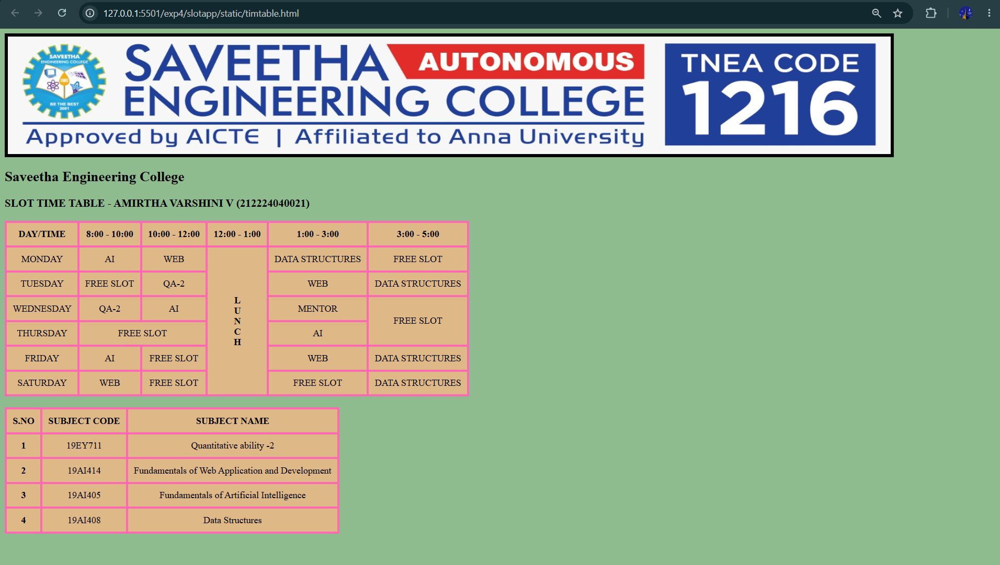

# Ex04 Time Table
# Date:
# AIM
To write a html webpage page to display your slot timetable.

# ALGORITHM
## STEP 1
Create a Django-admin Interface.

## STEP 2
Create a static folder and inert HTML code.

## STEP 3
Create a simple table using `<table>` tag in html.

## STEP 4
Add header row using `<th>` tag.

## STEP 5
Add your timetable using `<td>` tag.

## STEP 6
Execute the program using runserver command.

# PROGRAM

```
<html>
<head>
    <title>MY TIMETABLE</title>

    <style>
        body {
            background-color: darkseagreen;
        }

        table, th, td {
            background-color: burlywood;
            border: 4px solid hotpink;
            border-collapse: collapse;
        }

        th, td {
            padding: 10px;
            text-align: center;
        }

        span {
            writing-mode: vertical-lr;
            text-orientation: upright;
        }
    </style>
</head>

<body>

    

    <h2>Saveetha Engineering College</h2>
    <h3>SLOT TIME TABLE - AMIRTHA VARSHINI V (212224040021)</h3>

    <!-- TIMETABLE -->
    <table>
        <tr>
            <th>DAY/TIME</th>
            <th>8:00 - 10:00</th>
            <th>10:00 - 12:00</th>
            <th>12:00 - 1:00</th>
            <th>1:00 - 3:00</th>
            <th>3:00 - 5:00</th>
        </tr>

        <tr>
            <td>MONDAY</td>
            <td>AI</td>
            <td>WEB</td>
            <th rowspan="6"><span>LUNCH</span></th>
            <td>DATA STRUCTURES</td>
            <td>FREE SLOT</td>
        </tr>

        <tr>
            <td>TUESDAY</td>
            <td>FREE SLOT</td>
            <td>QA-2</td>
            <td>WEB</td>
            <td>DATA STRUCTURES</td>
        </tr>

        <tr>
            <td>WEDNESDAY</td>
            <td>QA-2</td>
            <td>AI</td>
            <td>MENTOR</td>
            <td rowspan="2">FREE SLOT</td>
        </tr>

        <tr>
            <td>THURSDAY</td>
            <td colspan="2">FREE SLOT</td>
            <td>AI</td>
        </tr>

        <tr>
            <td>FRIDAY</td>
            <td>AI</td>
            <td>FREE SLOT</td>
            <td>WEB</td>
            <td>DATA STRUCTURES</td>
        </tr>

        <tr>
            <td>SATURDAY</td>
            <td>WEB</td>
            <td>FREE SLOT</td>
            <td>FREE SLOT</td>
            <td>DATA STRUCTURES</td>
        </tr>
    </table>

    <br>

    <!-- SUBJECT TABLE -->
    <table>
        <tr>
            <th>S.NO</th>
            <th>SUBJECT CODE</th>
            <th>SUBJECT NAME</th>
        </tr>

        <tr>
            <th>1</th>
            <td>19EY711</td>
            <td>Quantitative ability -2</td>
        </tr>

        <tr>
            <th>2</th>
            <td>19AI414</td>
            <td>Fundamentals of Web Application and Development</td>
        </tr>

        <tr>
            <th>3</th>
            <td>19AI405</td>
            <td>Fundamentals of Artificial Intelligence</td>
        </tr>

        <tr>
            <th>4</th>
            <td>19AI408</td>
            <td>Data Structures</td>
        </tr>
    </table>

</body>
</html>
```
# OUTPUT



# RESULT
The program for creating slot timetable using basic HTML tags is executed successfully.
